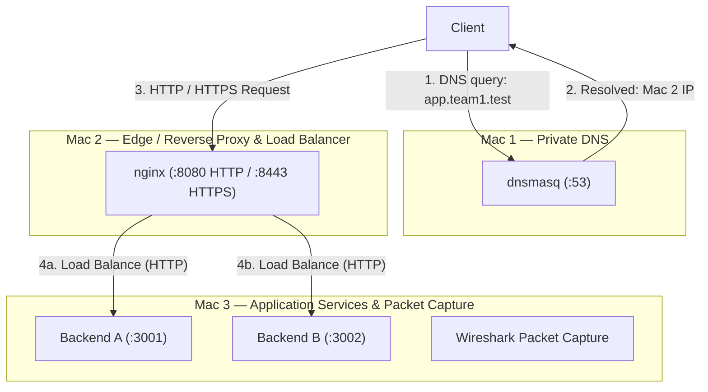

# Computer Networks Phase 1 — Private Network Service Platform

This repository hosts the architecture, configuration templates, documentation, implementation, and operational scripts for a private, multi-tier network service platform deployed across a physical local area network.

The system is deployed across **exactly three physical Macs**. Both application backend services run as separate concurrent processes on the same host (Mac 3).

---

## Machine Roles

| Machine | Role | Services |
|---|---|---|
| Mac 1 | Private DNS + client | dnsmasq :53 |
| Mac 2 | Edge / reverse proxy / load balancer / TLS | nginx :8080 / :8443 |
| Mac 3 | Backend A + Backend B + packet capture | Python :3001 / :3002 + Wireshark |

---

## Architecture



Both backend instances (`Backend A` on port `3001` and `Backend B` on port `3002`) reside concurrently on **Mac 3**.

---

## DNS Mappings

Mac 1 acts as the authoritative private DNS resolver (`dnsmasq`) for the `.test` domain namespace:

- `app.$TEAM.test` → Mac 2 IP (`$MAC2_IP`)
- `api.$TEAM.test` → Mac 2 IP (`$MAC2_IP`)

Any external queries (e.g. `google.com`) are forwarded upstream to `COLLEGE_DNS` (configured upstream resolver) and fallback DNS (`1.1.1.1`).

---

## Request Flow

The end-to-end traversal spans five distinct protocol layers and transitions:

```text
[ DNS ]     Client queries Mac 1 (UDP :53) for app.team1.test -> receives Mac 2 IP
   │
   ▼
[ TCP ]     Client initiates 3-way handshake (SYN, SYN-ACK, ACK) with Mac 2 (:8080 / :8443)
   │
   ▼
[ TLS ]     Client and Mac 2 negotiate cryptographic session on port 8443 (TLS 1.2 / 1.3)
   │
   ▼
[ HTTP ]    Client issues HTTP/1.1 request; Nginx terminates TLS and evaluates upstream pool
   │
   ▼
[ Backend ] Nginx forwards request to Mac 3 (Backend A :3001 or Backend B :3002) via LAN
```

---

## Repository Layout

```text
CN_Project/
│
├── README.md                           # Master project documentation & architecture overview
├── .gitignore                          # Exclusions for OS files, secrets, keys, and logs
│
├── backend/
│   └── server.py                       # Single Python backend running dual instances on Mac 3
│
├── config/                             # Service configuration templates & environment files
│   ├── README.md                       # Configuration guidelines & variable descriptions
│   ├── cn-team.env.example             # Network environment variables template (3 Macs)
│   ├── dnsmasq.conf.template           # Template for Mac 1 dnsmasq DNS resolver
│   ├── nginx/
│   │   ├── team-http.conf.template     # Template for Mac 2 HTTP load balancer (port 8080)
│   │   └── team-https.conf.template    # Template for Mac 2 HTTPS TLS load balancer (port 8443)
│   └── live/
│       ├── dnsmasq.conf                # Active verified configuration for Mac 1
│       ├── team-http.conf              # Active verified Mac 2 HTTP config (port 8080 redirect)
│       └── team-https.conf             # Active verified Mac 2 HTTPS TLS load balancer config (port 8443)
│
├── docs/                               # Detailed technical documentation
│   ├── 01-architecture.md              # Complete topology & multi-tier request flow
│   ├── 02-setup-flow.md                # 8-step orchestrated startup sequence
│   ├── 03-dns.md                       # dnsmasq private name resolution & upstream routing
│   ├── 04-backends.md                  # Dual Python backend instances (3001 & 3002) on Mac 3
│   ├── 05-load-balancer.md             # Nginx reverse proxy, round-robin, and failover
│   ├── 06-tls.md                       # Private CA, SAN certificates, and TLS termination
│   ├── 07-caching.md                   # HTTP caching headers, ETag validation, and 304 flows
│   ├── 08-packet-capture.md            # Wireshark inspection of DNS, TCP, TLS, and HTTP
│   └── 09-failure-demos.md             # Failure modes F1-F5 testing & recovery
│
├── evidence/                           # Experimental validation captures & artifacts
│   ├── README.md                       # Evidence collection guide & submission index
│   ├── A-lan/                          # LAN topology and inter-node ping reachability
│   ├── B-dns/                          # DNS lookup outputs (dig / nslookup)
│   ├── C-backends/                     # Direct backend health checks on ports 3001 & 3002
│   ├── D-load-balancing/               # Alternating X-Backend header responses
│   ├── E-tls/                          # Verbose curl TLS handshake & browser padlock screenshots
│   ├── F-caching/                      # Conditional request (If-None-Match) & 304 logs
│   ├── G-packet-capture/               # Wireshark .pcapng files & protocol flow screenshots
│   └── failures/                       # Verification outputs for failure test cases F1 through F5
│
└── scripts/                            # Operational automation scripts
    ├── README.md                       # Automation scripts overview
    ├── demo.sh                         # Automated verification & testing workflow (read-only)
    ├── make-certs.sh                   # TLS Root CA and server certificate generation script
    └── render-configs.sh               # Environment-driven configuration renderer
```

- **[backend/](backend/)**: Contains [server.py](backend/server.py), the unified backend implementation serving both Backend A (`:3001`) and Backend B (`:3002`) on Mac 3. Endpoints:
  - `GET /`: Basic backend response (`X-Backend: A` or `B`)
  - `GET /api/status`: Dynamic status (`Cache-Control: no-store`, `X-Backend: A` or `B`)
  - `GET /api/info`: Cacheable response (`Cache-Control: public, max-age=60`, `ETag`, `304 Not Modified` on `If-None-Match`, `X-Backend: A` or `B`)
- **[config/](config/)**: Decoupled service configuration templates ([dnsmasq.conf.template](config/dnsmasq.conf.template), [nginx/](config/nginx/)), environment variables template ([cn-team.env.example](config/cn-team.env.example)), and active live configurations in [config/live/](config/live/).
- **[docs/](docs/)**: Comprehensive documentation files covering architecture, setup flow, DNS resolution, backend operation, load balancing, TLS/PKI, HTTP caching, packet capture, and failure demonstration scenarios.
- **[evidence/](evidence/)**: Structured directories containing terminal logs, Wireshark `.pcapng` packet captures, and screenshots produced during live lab testing.
- **[scripts/](scripts/)**: Operational scripts:
  - `scripts/make-certs.sh`: Provisions the Team Root CA and server certificates with SANs (`app.$TEAM.test`, `api.$TEAM.test`) with overwrite protection.
  - `scripts/render-configs.sh`: Injects environment variables from `~/cn-team.env` into configuration templates to produce active configs in `config/live/`.
  - `scripts/demo.sh`: Comprehensive, read-only diagnostic and testing suite (`lan`, `dns`, `backends`, `lb`, `tls`, `http`, `cache`, `check`, `all`).

---

## Configuration & Environment Variables

All machine IP addresses and network variables are decoupled from reusable configuration templates. The active deployment environment is configured through `~/cn-team.env` (or `config/cn-team.env` via [config/cn-team.env.example](config/cn-team.env.example)):

| Variable | Description | Reusable Architectural Role | Current Tested Environment (Subject to change) |
|---|---|---|---|
| `TEAM` | Team namespace | Subdomain prefix (`app.$TEAM.test`, `api.$TEAM.test`) | `team1` |
| `MAC1_IP` | Mac 1 IPv4 | Private DNS resolver (`dnsmasq` on port 53) | `10.7.21.145` |
| `MAC2_IP` | Mac 2 IPv4 | Nginx edge proxy & TLS load balancer (:8080, :8443) | `10.7.19.92` |
| `MAC3_IP` | Mac 3 IPv4 | Host for Backend A (:3001) & Backend B (:3002) + Wireshark | `10.7.29.148` |
| `COLLEGE_DNS` | Upstream DNS resolver | Forwarding DNS resolver for external lookups | `8.8.8.8` |

> **Architecture Note:** Both Backend A (`:3001`) and Backend B (`:3002`) run concurrently on the same host (Mac 3, `$MAC3_IP`). There is NO Mac 4. Historical packet capture and failure demonstration traces preserve their original recorded addresses as historical evidence.

---

## Getting Started

1. **Review Architecture:** Read [docs/01-architecture.md](docs/01-architecture.md) for full system topology.
2. **Review Setup Sequence:** Read [docs/02-setup-flow.md](docs/02-setup-flow.md) for network connection guidelines and service startup order.
3. **Configure Environment:** Copy [config/cn-team.env.example](config/cn-team.env.example) to `~/cn-team.env` (or `config/cn-team.env`) and populate your LAN IP addresses.
4. **Generate Certificates (on Mac 2):** Run `./scripts/make-certs.sh` to generate the Team Root CA and server certificates. Distribute `team-CA.pem` to client devices.
5. **Generate Configurations:** Run `./scripts/render-configs.sh` to produce deployable files in `config/live/`.
6. **Verify System Functionality:** Run `./scripts/demo.sh check` or `./scripts/demo.sh all` from any machine on the LAN to test end-to-end connectivity, DNS, TLS, load balancing, and HTTP caching.
