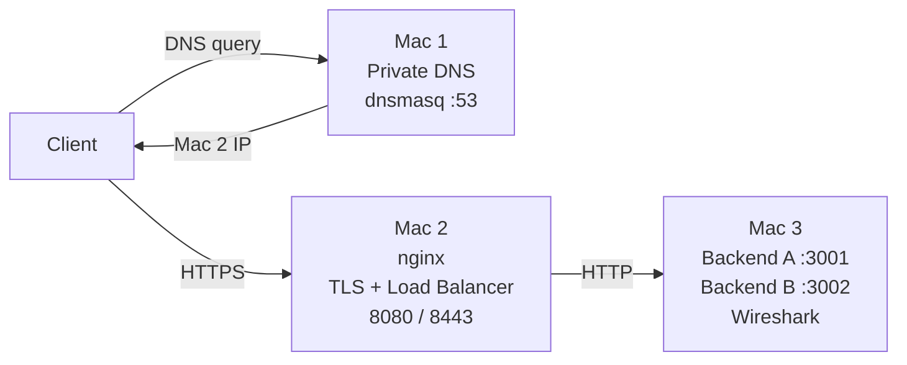

# Private Network Service Platform

### Computer Networks Course Project — Phase 1

This repository hosts the architecture, configuration templates, documentation, and operational scripts for a private, multi-tier network service platform deployed across a physical local area network.

The system is deployed across **exactly three physical Macs**. There is **NO Mac 4**; both application backend services run as separate concurrent processes on the same host (Mac 3).

---

## Team Architecture

| Machine | Role | Service |
|---|---|---|
| Mac 1 | Private DNS + client | dnsmasq :53 |
| Mac 2 | Edge / reverse proxy / LB / TLS | nginx :8080/:8443 |
| Mac 3 | Backend A + Backend B + packet capture | Python :3001/:3002 + Wireshark |

---

## Network Architecture Diagram



---

## Repository Structure

```text
CN_Project/
├── README.md                           # Master project documentation & architecture overview
├── .gitignore                          # Exclusions for OS files, secrets, keys, and logs
│
├── config/                             # Service configuration templates & environment files
│   ├── README.md                       # Configuration guidelines & variable descriptions
│   ├── cn-team.env.example             # Network environment variables template (3 Macs)
│   ├── dnsmasq.conf.template           # Template for Mac 1 dnsmasq DNS resolver
│   ├── nginx/
│   │   ├── team-http.conf.template     # Template for Mac 2 HTTP load balancer (port 8080)
│   │   └── team-https.conf.template    # Template for Mac 2 HTTPS TLS load balancer (port 8443)
│   └── live/
│       └── .gitkeep                    # Directory for active rendered runtime configurations
│
├── backend/
│   └── .gitkeep                        # Destination for Python backend implementation (server.py)
│
├── scripts/                            # Operational automation scripts (placeholders)
│   ├── README.md                       # Automation scripts overview
│   ├── make-certs.sh                   # TLS Root CA and server certificate generation script
│   ├── render-configs.sh               # Environment-driven configuration renderer
│   └── demo.sh                         # Automated verification & testing workflow
│
├── docs/                               # Detailed technical documentation
│   ├── 01-architecture.md              # Complete topology & multi-tier request flow
│   ├── 02-setup-flow.md                # Network prerequisites & strict startup sequence
│   ├── 03-dns.md                       # dnsmasq private name resolution & upstream routing
│   ├── 04-backends.md                  # Dual Python backend instances (3001 & 3002) on Mac 3
│   ├── 05-load-balancer.md             # Nginx reverse proxy, round-robin, and failover
│   ├── 06-tls.md                       # Private CA, SAN certificates, and TLS termination
│   ├── 07-caching.md                   # HTTP caching headers, ETag validation, and 304 flows
│   ├── 08-packet-capture.md            # Wireshark inspection of DNS, TCP, TLS, and HTTP
│   └── 09-failure-demos.md             # Failure modes F1-F5 testing & graceful recovery
│
└── evidence/                           # Experimental validation captures & artifacts
    ├── README.md                       # Evidence collection guide & submission index
    ├── A-lan/                          # LAN topology and inter-node ping reachability
    ├── B-dns/                          # DNS lookup outputs (dig / nslookup)
    ├── C-backends/                     # Direct backend health checks on ports 3001 & 3002
    ├── D-load-balancing/               # Alternating X-Backend header responses
    ├── E-tls/                          # Verbose curl TLS handshake & browser padlock screenshots
    ├── F-caching/                      # Conditional request (If-None-Match) & 304 logs
    ├── G-packet-capture/               # Wireshark .pcapng files & protocol flow screenshots
    └── failures/                       # Verification outputs for failure test cases F1 through F5
```

---

## Configuration Variables

All machine IP addresses and network variables are decoupled from configuration templates using environment variables:

| Variable | Description | Current Value (Subject to change) |
|---|---|---|
| `TEAM` | Team namespace | `team1` |
| `MAC1_IP` | Mac 1 IPv4 (Private DNS) | `10.7.21.145` |
| `MAC2_IP` | Mac 2 IPv4 (Edge Nginx / LB) | `10.7.19.92` |
| `MAC3_IP` | Mac 3 IPv4 (Dual Backends) | `10.7.29.148` |
| `COLLEGE_DNS` | Upstream DNS resolver | `8.8.8.8` |

> **Crucial Architecture Rule:** Both Backend A (`:3001`) and Backend B (`:3002`) run on `MAC3_IP`. There is no `MAC4_IP`.

---

## Getting Started

1. **Review Architecture:** Read [docs/01-architecture.md](file:///docs/01-architecture.md) for full system topology.
2. **Review Setup Sequence:** Read [docs/02-setup-flow.md](file:///docs/02-setup-flow.md) for network connection guidelines and service startup order.
3. **Configure Environment:** Copy [config/cn-team.env.example](file:///config/cn-team.env.example) to `config/cn-team.env` and populate your LAN IP addresses.
4. **Generate Configurations:** Run `./scripts/render-configs.sh` to produce deployable files in `config/live/`.
