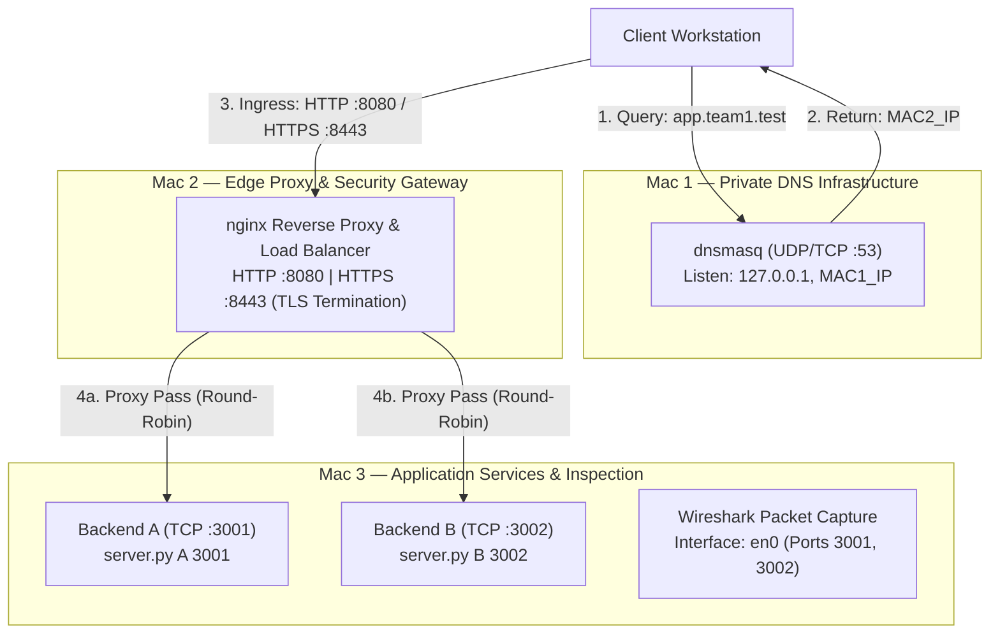

# System Architecture Specification

## Overview

The **Private Network Service Platform** is an isolated multi-tier network deployment designed to demonstrate core computer networking concepts: private DNS resolution, edge reverse proxying, Layer 7 load balancing, TLS termination, HTTP caching semantics, and deep packet inspection.

The entire topology is deployed across **exactly three physical Mac computers** communicating over a shared local area network (LAN).

Both backend application services (Backend A and Backend B) run as separate concurrent processes on the same host (**Mac 3**).

---

## Node Roles and Allocation

| Machine | Role | Software / Service | Ports | Description |
|---|---|---|---|---|
| **Mac 1** | Private DNS Server & Test Client | `dnsmasq` | UDP 53 / TCP 53 | Resolves team local domain records (`app.team1.test`, `api.team1.test`) to Mac 2; forwards external queries to upstream resolvers. |
| **Mac 2** | Edge Proxy, Load Balancer & TLS Termination | `nginx` | TCP 8080 (HTTP)<br/>TCP 8443 (HTTPS) | Acts as edge reverse proxy, terminates TLS connections, and load-balances traffic across Mac 3 backends. |
| **Mac 3** | Dual Backend Services & Packet Capture | Python 3 (`server.py`), Wireshark | TCP 3001 (Backend A)<br/>TCP 3002 (Backend B) | Hosts Backend A and Backend B as independent Python HTTP processes; captures network traffic via Wireshark. |

---

## IP Inventory (Placeholder & Current Mapping)

Reusable templates decouple host addresses using environment variable placeholders:

| Host Designation | Variable Placeholder | Current LAN IP | Assigned Role |
|---|---|---|---|
| Mac 1 | `MAC1_IP` | `10.7.21.145` | Private DNS Resolver (`dnsmasq`) & Client |
| Mac 2 | `MAC2_IP` | `10.7.19.92` | Nginx Edge / Reverse Proxy / TLS Load Balancer |
| Mac 3 | `MAC3_IP` | `10.7.29.148` | Dual Application Backends (`:3001`, `:3002`) & Wireshark Capture |
| Upstream DNS | `COLLEGE_DNS` | `8.8.8.8` | Campus / Upstream Fallback DNS Resolver |

---

## Network Topology



---

## Multi-Tier Request Flow

```text
[ Client ]
    │
    │ 1. DNS Query: "app.team1.test"
    ▼
[ Mac 1: Private DNS (dnsmasq :53) ]
    │
    │ 2. Resolves "app.team1.test" -> Mac 2 IP (10.7.19.92)
    ▼
[ Client ]
    │
    │ 3. HTTP (8080) / HTTPS (8443) Ingress Request
    ▼
[ Mac 2: Edge Reverse Proxy & Load Balancer (nginx) ]
    │
    ├───────────────────────────────┐
    │ 4a. Forward to Backend A      │ 4b. Forward to Backend B
    ▼                               ▼
[ Mac 3: Backend A (:3001) ]   [ Mac 3: Backend B (:3002) ]
                ▲
                │ (All Mac 3 traffic monitored via Wireshark)
```

1. **DNS Lookup:** The client queries Mac 1 (`dnsmasq` listening on port 53) for `app.team1.test` or `api.team1.test`. Mac 1 returns the IPv4 address of Mac 2 (`MAC2_IP`).
2. **Edge Ingress:** The client connects to Mac 2 on port 8080 (HTTP) or port 8443 (HTTPS with TLS termination).
3. **Load Balancing:** Nginx on Mac 2 proxies the request to the upstream pool consisting of Mac 3 port 3001 (Backend A) and Mac 3 port 3002 (Backend B) in a round-robin schedule.
4. **Backend Processing:** Mac 3 processes the request on the selected port and responds with an identifying header (`X-Backend: A` or `X-Backend: B`).
5. **Packet Inspection:** Wireshark on Mac 3 captures ingress TCP connections, HTTP requests, responses, and local packet timing.

---

## Protocol Layers Architecture

The multi-tier architecture exercises all major layers of the TCP/IP stack:

| Layer | Protocol / Technology | Function in System |
|---|---|---|
| **Application** | HTTP/1.1, DNS (RFC 1035) | Name resolution, client-to-proxy web traffic, reverse proxy upstream requests, caching semantics. |
| **Security / Presentation** | TLS 1.2 / TLS 1.3 | Cryptographic channel encryption, PKI validation via private Root CA, SAN verification. |
| **Transport** | TCP, UDP | Reliable byte-stream transport for HTTP/TLS (ports 8080, 8443, 3001, 3002); datagram transport for DNS queries (port 53). |
| **Network (Internet)** | IPv4, ICMP | Host routing across the private subnet (`10.7.x.x`); connectivity checks via ICMP echo (`ping`). |
| **Link / Physical** | 802.11 (Wi-Fi) / 802.3 (Ethernet) | Frame transmission across physical adapters (`en0`). |

---

## Implementation & Testing Notes

- **Node Allocations & IP Assignments:** Verified across Mac 1 (`10.7.21.145`), Mac 2 (`10.7.19.92`), and Mac 3 (`10.7.29.148`).
- **Packet Flow Verification:** Completed and stored in `evidence/G-packet-capture/phase1-full-flow-tls12.pcapng`.
- **MTU & Link Speed Benchmarks:** *Not measured in Phase 1*.
- **Inter-node Latency Benchmarks:** *Not measured in Phase 1*.
